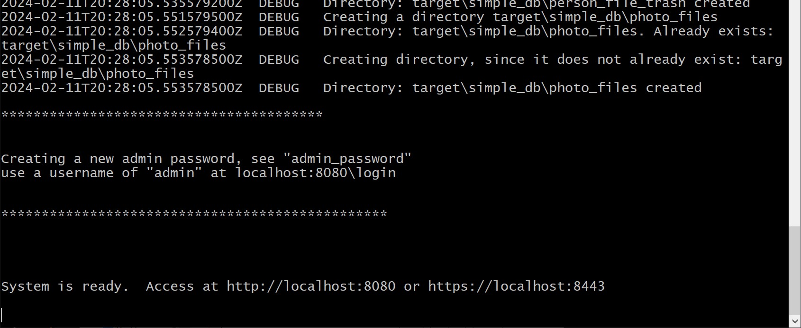
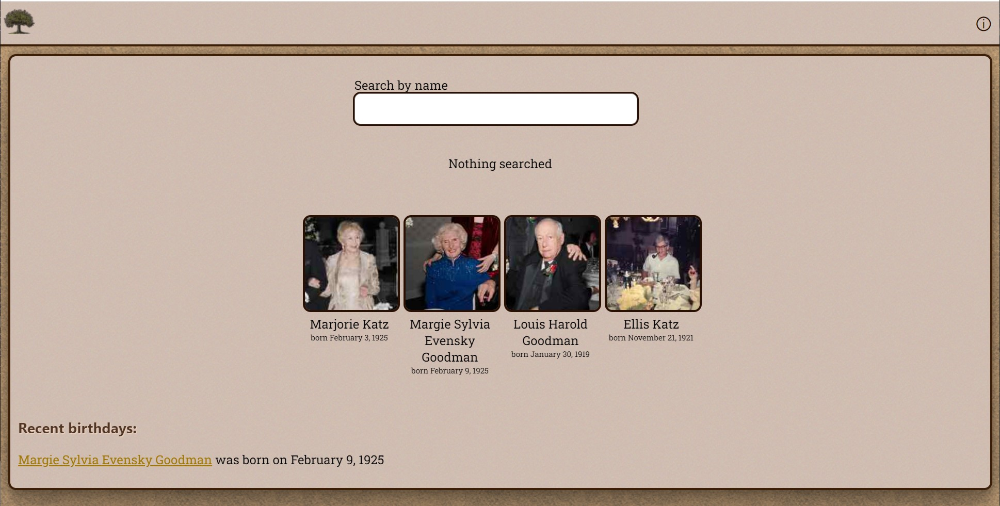
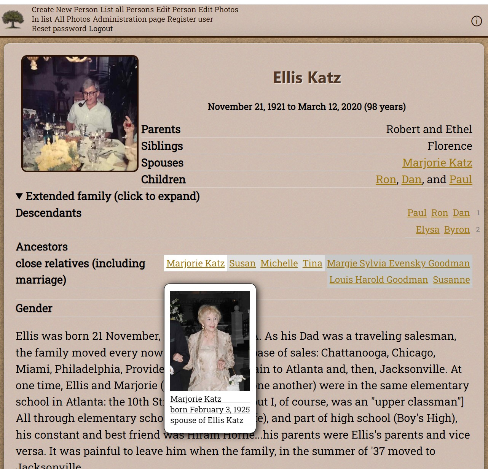
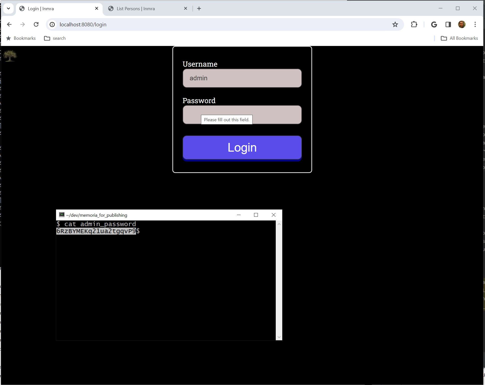
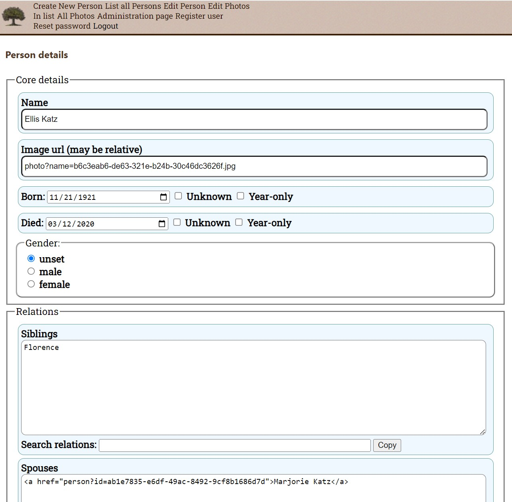
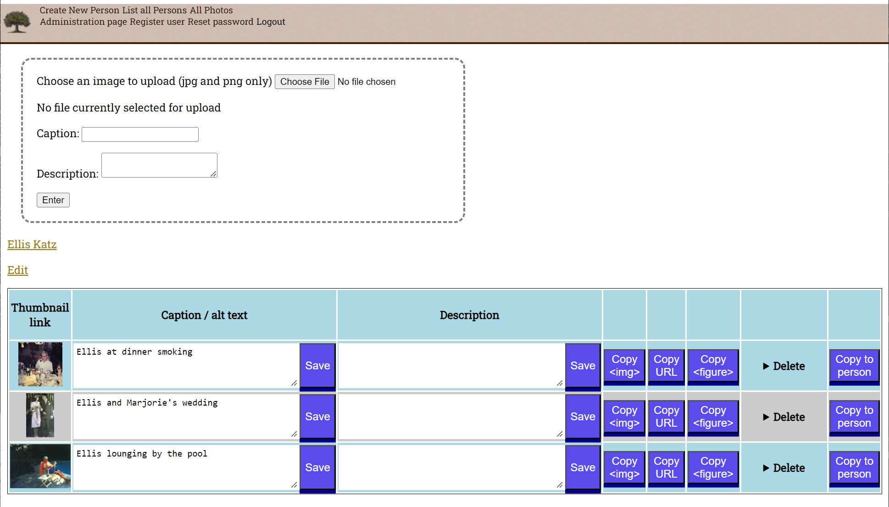

Memoria, a site for memories
============================

Memoria, a site for memories, production site at https://inmra.com/

This is a combination memorial and a family tree.  It provides an
ability to easily add information for family members.  This
information includes relations to other family members, biographical
info, and photographs.

Interesting technical aspects of the project:

- Size of the application, including all necessary dependencies: 600 Kb.
- Database/Web server: included, provided by [Minum](https://github.com/byronka/minum)
- Startup time: 500 milliseconds
- Average memory usage: 64 Mb
- Peak memory usage: 300 Mb with 176 persons and 387 photos under heavy continuous loading
- Average time per request: 5 milliseconds

Quick Start, after cloning
--------------------------

_Build and run:_

```shell
make restore_sampledb
make run
```
_Run pre-built system:_

```shell
cd docs
tar zxf inmra.tar.gz
cd inmra
./start.sh
```

Quick Start, downloading binary
-------------------------------

- Download it [here](https://github.com/byronka/memoria_project/raw/master/docs/inmra.tar.gz)
- decompress it: `tar zxf inmra.tar.gz`
- change to its directory: `cd inmra`
- start the program: `java -jar inmra.jar` or `docker compose up -d`
  - the README in the inmra directory has useful info

More-detailed Quick Start
-------------------------

This is a ongoing long-term project to develop software for combined family tree and memorial site. While it
is incomplete, it acts as a realistic example for the [Minum](https://github.com/byronka/minum) web framework.

* This project uses Gnu Make as its build tool, wrapping calls to [Maven](https://maven.apache.org/)
* To load a sample database: `make restore_sampledb`, then run with `make run`.  Wait until the
  message "System is ready" and then hit http://localhost:8080
  * To operate as an administrator, login at http://localhost:8080/login with a username of admin and 
    the password in the file "admin_password" in the root of the database directory. 
* To run tests: `make test`
* For help: `make`
* Production version running at https://inmra.com

See the [development handbook](docs/development_handbook.md)

System requirements: 
--------------------

Developed on a Windows 10 64-bit professional, on Cygwin, OpenJDK 21, with Gnu Make 4.4

Directories:
------------

- docs: documentation for the project
- cloud_operations: documents and scripts for deployment to the cloud
- .git: necessary files for Git.
- sample_db: a test database
- scripts: scripts that are run during compilation / analyzing / preparation for deployment
- src: source code for the application
- ui_tests: a separate project directory for the UI end-to-end tests

Root-level files:
-----------------

- .gitignore: files we want Git to ignore.
- .gitattributes: some details of how we want Git to operate on our project
- Makefile: configuration for the build tool, Gnu Make
- memoria.iml: untracked by Git - a configuration file for Intellij (optional)
- mvnw, mvnw.cmd - Maven's "wrapper" files - a way to provide Maven without it being already installed.
- pom.xml: Maven's configuration file, for building and obtaining dependencies
- README.md: this file
- SYSTEM_RUNNING: if this exists, it means the application is running


<hr>

<hr>

<hr>

<hr>

<hr>

